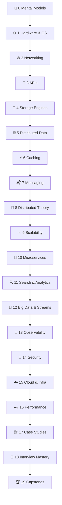

# System Design From Scratch

```
░░░░░░░░░░░░░░░░░░░░░░░░░░░░░░░░░░░░░░░░░░░░░░░░░░░░░░░░░░░░░░░░░░░░░░
░░                                                                  ░░
░░   ┌─────────┐      ┌─────────┐      ┌─────────┐                  ░░
░░   │ CLIENT  │─────▶│   LB    │─────▶│ SERVER  │──┐               ░░
░░   └─────────┘      └─────────┘      └─────────┘  │               ░░
░░                                          │       ▼               ░░
░░        SYSTEM DESIGN                ┌────▼───┐ ┌──────┐          ░░
░░        FROM SCRATCH                 │ CACHE  │ │  DB  │          ░░
░░                                     └────────┘ └──────┘          ░░
░░                                                                  ░░
░░░░░░░░░░░░░░░░░░░░░░░░░░░░░░░░░░░░░░░░░░░░░░░░░░░░░░░░░░░░░░░░░░░░░░
```

**226 lessons. 20 phases. Every system taken apart down to the hardware
before a single cloud service gets name-dropped.**

You don't just learn system design. You rebuild it. From the spinning
disk up to the multi-region deployment. By hand.

- 🧠 **No hand-waving** — every "it scales" claim comes with the math
- 🔧 **Build it first** — LRU caches, rate limiters, consistent hashing, Raft… implemented from scratch in `code/`
- 🎭 **War stories** — real outages and real postmortems, because failure is the best teacher
- ✅ **Checkpoints** — every lesson ends with quiz questions so you can't lie to yourself
- 💸 **Free forever** — MIT licensed, runs on your laptop, no paywalls

## The Seven-Beat Lesson Pattern

Every lesson cycles through the same seven beats:

| Beat | What it does |
|---|---|
| **MOTTO** | The whole lesson in one sentence |
| **PROBLEM** | The concrete pain that makes this topic exist |
| **CONCEPT** | Intuition first — analogies and ASCII diagrams before jargon |
| **BUILD IT** | The mechanism, from scratch — code or step-by-step mechanics |
| **USE IT** | The production tools that do this for you (and their tradeoffs) |
| **WAR STORY** | A real-world outage, paper, or engineering legend |
| **CHECKPOINT** | Quiz questions — if you can't answer, re-read |

## The 20 Phases



| # | Phase | Lessons | You will be able to… |
|---|---|---|---|
| 0 | [🧠 Setup & Mental Models](phases/00-setup-and-mental-models/README.md) | 8 | Estimate anything on a napkin |
| 1 | [⚙️ Hardware & OS Foundations](phases/01-hardware-and-os/README.md) | 12 | Explain why disk seeks ruin your day |
| 2 | [🌐 Networking From First Principles](phases/02-networking/README.md) | 14 | Trace a request from keyboard to server |
| 3 | [🔌 APIs & Serialization](phases/03-apis-and-serialization/README.md) | 10 | Design contracts machines can't break |
| 4 | [💾 Databases I — Storage Engines](phases/04-storage-engines/README.md) | 12 | Explain B-trees vs LSM trees cold |
| 5 | [🗄️ Databases II — Distributed Data](phases/05-distributed-data/README.md) | 14 | Shard, replicate, and sleep at night |
| 6 | [⚡ Caching](phases/06-caching/README.md) | 10 | Invalidate caches without incidents |
| 7 | [📬 Messaging & Async Processing](phases/07-messaging-and-async/README.md) | 12 | Choose delivery semantics on purpose |
| 8 | [🎲 Distributed Systems Theory](phases/08-distributed-theory/README.md) | 14 | Explain Raft to a rubber duck |
| 9 | [📈 Scalability Patterns](phases/09-scalability-patterns/README.md) | 12 | Take one server to a million RPS |
| 10 | [🧩 Microservices & Service Architecture](phases/10-microservices/README.md) | 12 | Know when NOT to use microservices |
| 11 | [🔍 Search & Analytics](phases/11-search-and-analytics/README.md) | 10 | Build an inverted index by hand |
| 12 | [🌊 Big Data & Stream Processing](phases/12-big-data-and-streams/README.md) | 10 | Reason about windows and watermarks |
| 13 | [🔭 Observability & Reliability](phases/13-observability-and-reliability/README.md) | 12 | Set SLOs that mean something |
| 14 | [🔐 Security & Identity](phases/14-security/README.md) | 10 | Threat-model your own designs |
| 15 | [☁️ Cloud, Containers & Infrastructure](phases/15-cloud-and-infrastructure/README.md) | 12 | Deploy to multi-region without fear |
| 16 | [🏎️ Performance Engineering](phases/16-performance-engineering/README.md) | 10 | Hunt p99 latency like a professional |
| 17 | [🏗️ Case Studies — Design the Classics](phases/17-case-studies/README.md) | 16 | Whiteboard Twitter, Uber, YouTube… |
| 18 | [🎤 Interview Mastery](phases/18-interview-mastery/README.md) | 8 | Pass the loop, at your target level |
| 19 | [🏆 Capstone Projects](phases/19-capstones/README.md) | 8 | Ship real distributed systems |

## Runnable Code

Every core primitive gets a from-scratch, dependency-free Python
implementation in [`code/`](code/):

```
code/
├── consistent_hashing.py     # hash ring with virtual nodes
├── lru_cache.py              # O(1) LRU with doubly-linked list
├── rate_limiter.py           # token bucket, leaky bucket, sliding window
├── bloom_filter.py           # probabilistic membership
├── vector_clock.py           # causality tracking
├── lsm_tree.py               # memtable + SSTables + compaction
├── gossip.py                 # epidemic protocol simulation
├── load_balancer.py          # round-robin, least-conn, weighted, hash
├── raft_lite.py              # leader election + log replication
├── message_queue.py          # partitioned log with consumer groups
├── inverted_index.py         # tokenize, index, BM25 rank
└── url_shortener.py          # base62 + a tiny end-to-end system
```

Run any of them: `python code/consistent_hashing.py` — each file is a
lesson in itself, with a demo in `__main__`.

## How to Use This

1. **Beginner?** Start at Phase 0 and go in order. The phases form a
   dependency chain — each builds on the last.
2. **Experienced?** Jump to the phase that scares you. Each lesson is
   self-contained enough to read standalone.
3. **Interview in two weeks?** Do Phase 0, skim 4–9, then live in
   Phases 17–18.
4. **Track progress** on the website — checkboxes persist in your
   browser, and every lesson title links to a styled reader page.

The website lives in [`site/`](site/) — open `site/index.html` directly,
no server needed. Reader pages are generated from the phase markdown:
`python scripts/build_site.py` (rerun after editing any lesson).

## Philosophy

> Frameworks change. Fundamentals compound.

Cloud products are rented; mental models are owned. When you know *why*
Kafka partitions exist, every message queue makes sense. When you've
built consistent hashing by hand, every sharded database is familiar.
This curriculum optimizes for the knowledge that transfers.

## License

MIT. Use it, fork it, teach with it.
